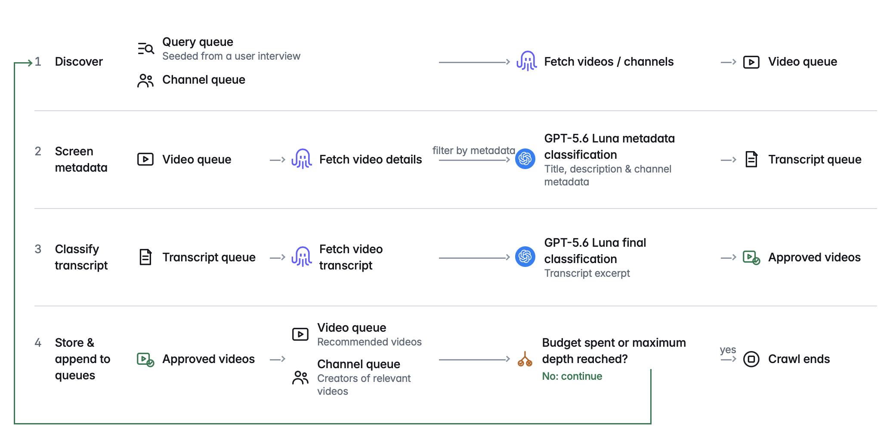

# yt-crawl

A YouTube research crawler using [SearchAPI](https://www.searchapi.io/?utm_source=&utm_medium=Ambassador&utm_campaign=simmering.dev) to get data and an LLM for choosing what to pursue. It finds videos for a topic, keeps those that match the research scope, and saves their target-language transcripts and an append-only audit trail.



This is research code accompanying the related article: link. It is AI-generated and will not be maintained.

## SearchAPI

Create an account, then put `SEARCHAPI_API_KEY` in `.env`.

Pydantic response models are generated from the OpenAPI specs in `openapi/` with `scripts/generate_models.sh`. Rerun it only when those specs or the codegen flags change.

## LLM

Classification uses LiteLLM. Set `MODEL` to a `provider/model` string and the matching provider key. Examples:

```bash
MODEL=openai/gpt-5.6-luna
OPENAI_API_KEY=...

MODEL=anthropic/claude-sonnet-4-5
ANTHROPIC_API_KEY=...

MODEL=openai/llama3
LLM_API_BASE=http://127.0.0.1:11434/v1
OPENAI_API_KEY=ollama
```

## Run the crawler

Python 3.13 and [uv](https://docs.astral.sh/uv/) are required.

```bash
uv sync
cp .env.example .env
```

Add `SEARCHAPI_API_KEY`, `MODEL`, and the provider API key to `.env`, then start a project:

```bash
uv run yt-crawl start
```

The terminal asks for the topic, language, publication-date boundary, budget, project folder, and crawl limits. It also asks a few questions to define which videos count as relevant. The crawler then shows live progress and writes the project data.

To run without the settings prompts, pass the required values yourself:

```bash
uv run yt-crawl start \
  --topic "personal finance" \
  --language de \
  --start-date 2024-01-01 \
  --max-credits 50 \
  --project runs/personal-finance-de \
  --model openai/gpt-5.6-luna
```

The project folder must be new or empty. The research-scope questions still appear, even when run settings are supplied as flags.

## Resume or expand a project

Use the same project folder to continue after a budget stop, interruption, or failure. Completed work and cached SearchAPI responses are reused. The stored model is reused unless `--model` is passed.

```bash
uv run yt-crawl resume \
  --project runs/personal-finance-de \
  --add-credits 30 \
  --max-search-pages 2
```

```bash
uv run yt-crawl resume \
  --project runs/personal-finance-de \
  --set-credits 100
```

To find more material after a completed run, widen at least one scope limit or move `--start-date` earlier. Scope limits can only increase on resume. Before a session starts, the CLI checks that the SearchAPI account balance can cover its remaining possible requests.

## What you get

Each project is self-contained and resumable. Its main files are:

| File                                                             | Contents                                                               |
| ---------------------------------------------------------------- | ---------------------------------------------------------------------- |
| `crawl_state.json`                                               | Checkpoint, saved settings, and credit ledger.                         |
| `transcript.jsonl`                                               | Collected target-language transcripts.                                 |
| `relevance_decision.jsonl`                                       | Metadata and transcript relevance decisions.                           |
| `video_candidate.jsonl`, `channel.jsonl`, `discovery_edge.jsonl` | Discovered videos, channels, and their links.                          |
| `api_call.jsonl`, `budget_event.jsonl`, `run_error.jsonl`        | Provider activity, credit use, and errors.                             |
| `.cache/searchapi/`                                              | Project-local request cache; identical later requests cost no credits. |

All session records append to these files.

## CLI options

### start

| Option                 | Description                                                                                                                      |
| ---------------------- | -------------------------------------------------------------------------------------------------------------------------------- |
| `--topic`              | Research topic or question.                                                                                                      |
| `--project`            | Project folder. Must be new or empty.                                                                                            |
| `--max-credits`        | Hard SearchAPI grant for a new project (minimum 4). Search pages, channel pages, video details, and transcripts consume credits. |
| `--language`           | Required video and transcript language, for example `en` or `de`.                                                                |
| `--start-date`         | Inclusive earliest publication date (`YYYY-MM-DD`).                                                                              |
| `--max-depth`          | Related/channel graph depth (0–5).                                                                                               |
| `--max-queries`        | Maximum query variants (2–18).                                                                                                   |
| `--max-search-pages`   | Pages fetched per planned search query (1–10).                                                                                   |
| `--max-channel-pages`  | Pages fetched per discovered channel.                                                                                            |
| `--country`            | SearchAPI YouTube `gl` code.                                                                                                     |
| `--interface-language` | SearchAPI YouTube `hl` code. This is not the content-language gate.                                                              |
| `--searchapi-timeout`  | Per-request SearchAPI timeout in seconds.                                                                                        |
| `--searchapi-retries`  | Extra budgeted attempts for transient SearchAPI failures. Every dispatched attempt is audited and charged.                       |
| `--searchapi-workers`  | Maximum concurrent SearchAPI requests. Controls speed, not crawl scope.                                                          |
| `--llm-workers`        | Maximum concurrent LLM classification requests. Controls speed, not crawl scope.                                                 |
| `--model`              | LiteLLM `provider/model` string. Defaults to the env var `MODEL` or `openai/gpt-5.6-luna` if unset.                              |
| `--llm-api-base`       | Optional OpenAI-compatible API base URL. Defaults to `LLM_API_BASE` env var if set.                                              |

### resume

| Option                | Description                                                                                                           |
| --------------------- | --------------------------------------------------------------------------------------------------------------------- |
| `--project`           | Existing project folder.                                                                                              |
| `--add-credits`       | Add N credits to the lifetime grant. Use `0` to reuse unspent remaining. Cannot be combined with `--set-credits`.     |
| `--set-credits`       | Overwrite remaining credits and split them across discovery and transcripts. Cannot be combined with `--add-credits`. |
| `--show`              | Print the saved dashboard and session summary without contacting providers or changing the project.                   |
| `--start-date`        | Inclusive earliest publication date (`YYYY-MM-DD`). May only move this date earlier.                                  |
| `--max-depth`         | Related/channel graph depth (0–5). May only increase it.                                                              |
| `--max-queries`       | Maximum query variants (2–18). May only increase it.                                                                  |
| `--max-search-pages`  | Pages fetched per planned search query (1–10). May only increase it.                                                  |
| `--max-channel-pages` | Pages fetched per discovered channel. May only increase it.                                                           |
| `--searchapi-retries` | Extra budgeted attempts for transient SearchAPI failures. Every dispatched attempt is audited and charged.            |
| `--searchapi-workers` | Maximum concurrent SearchAPI requests. Controls speed, not crawl scope.                                               |
| `--llm-workers`       | Maximum concurrent LLM classification requests. Controls speed, not crawl scope.                                      |
| `--model`             | Override the LiteLLM model stored on this project.                                                                    |
| `--llm-api-base`      | Override the optional OpenAI-compatible API base URL stored on this project.                                          |

```bash
uv run yt-crawl start --help
uv run yt-crawl resume --help
```

## Logfire telemetry

Local JSONL auditing is always on. `LOGFIRE_TOKEN` optionally enables remote [Logfire](https://logfire.pydantic.dev/) telemetry; set `YT_CRAWL_DISABLE_TELEMETRY=1` to disable it explicitly.

## Development checks

```bash
uv run --frozen pytest -q
uv run --frozen ruff check .
```

Tests use fake clients and make no SearchAPI or LLM requests.
